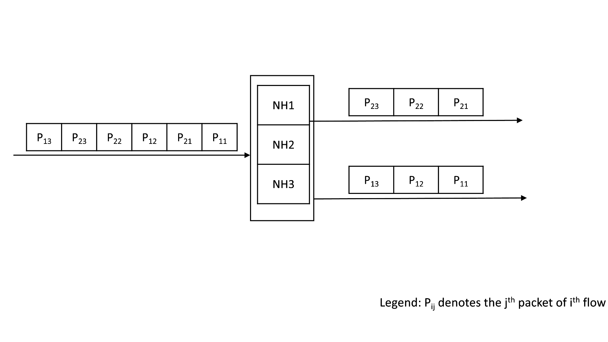
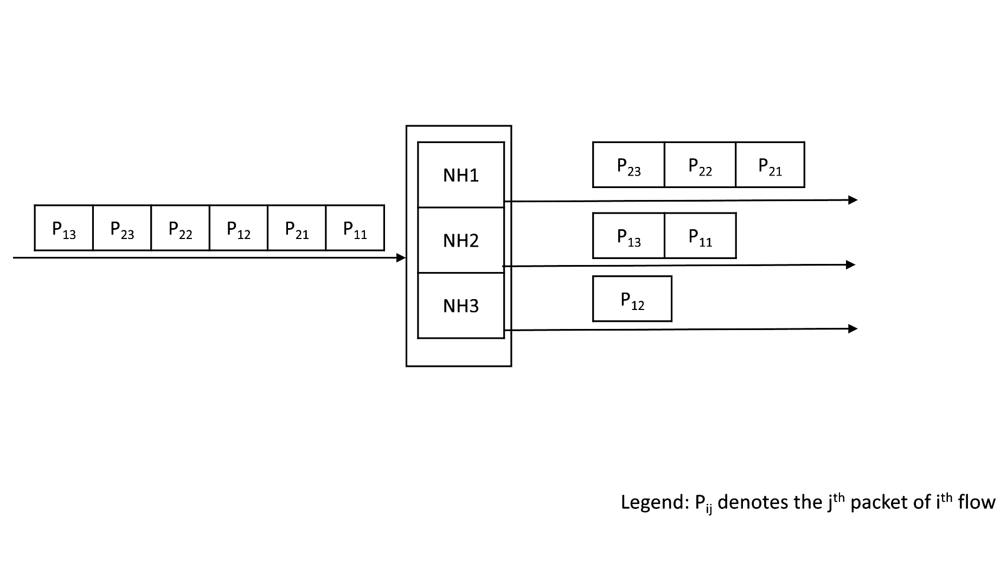
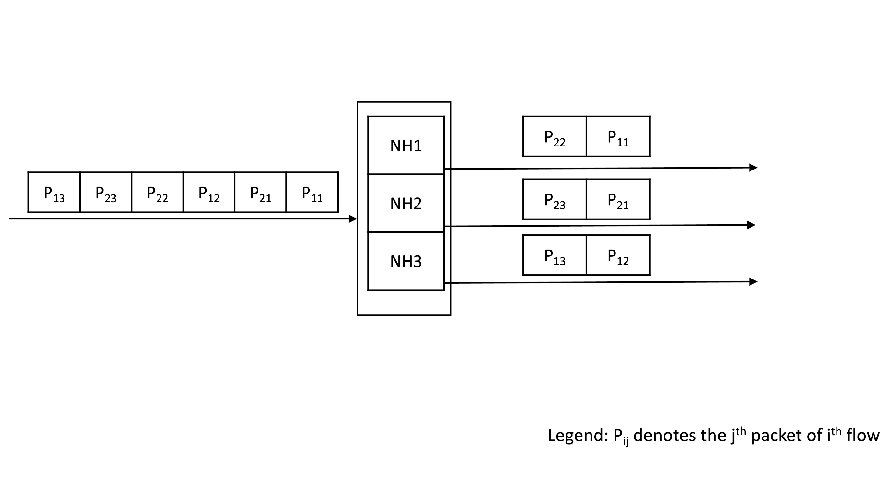

# [SAI] Static Member Selection Modes for ECMP and LAG
-------------------------------------------------------------------------------
 Title       | Static Member Selection Modes for ECMP and LAG
-------------|-----------------------------------------------------------------
 Authors     | Dhruvkumar Kadia, Ravindranath C K (Marvell)
 Status      | In review
 Type        | Standards track
 Created     | 2024-09-19
 SAI-Version | 1.14
-------------------------------------------------------------------------------

## 1.0  Introduction

ECMP or Next hop groups (NHG) and LAG use load balancing techniques to spread the traffic across the various members. The most common load balancing technique is to use hash-based member selection. In this technique, flows are identified by performing a hash on a set of packet fields like the 5-tuple, and then selecting the group member based on the computed hash value.
This technique has been traditionally used since it:
 1) ensures packet ordering (since packets of a given flow are always sent out on the same member), and 
 2) is stateless.

However, traditional hash-based load balancing techniques are *static* in the sense that they do not adapt according to the actual state (link failure, port load etc.) of the member. Adaptive Routing and Switching (ARS), is a recent load balancing technique that adapts to the state of the members. ARS maintains state of the member (link status, port load, queue load, path load etc.) to select the ECMP/LAG member that are active and have least load. ARS modes such as SAI_ARS_MODE_FLOWLET_QUALITY also maintain state (idle time and assigned member) per flow in order to ensure packets of a flow are not sent out of order.

There are emerging HPC and AI/ML use-cases where packets of the same flow are sprayed across multiple paths to achieve high bandwidth. In these applications, the packet ordering is done by the higher layers of the network stack at the host nodes; the network does not need to ensure packet order.

This proposal introduces the below two types of light weight *static* member selection modes for ECMP/LAG to address these use-cases:

 * Random 
 * Round Robin

## 2.0  Behavior

### Existing hash based member selection
For every packet hitting the ECMP/LAG, the egress member is selected based on the computed hash value.


### Random member selection
For every packet hitting the ECMP/LAG, the egress member is randomly selected.



Unlike ARS modes like SAI_ARS_MODE_PER_PACKET_RANDOM, the static member selection modes do not adapt based on the member link status.

### Round-robin member selection
For every packet hitting the ECMP/LAG, the egress member is selected in round robin mode.


## 3.0 SAI Enhancement

A new enum type is defined to denote the static member selection modes.
New attributes are introduced in the NHG and LAG to allow the user to configure the static member selection mode.
Further, an ACL action is introduced to set the static member selection mode.

1) Enum defining the static member selection mode :
   ```c
   /**
   * @brief Static member selection mode
   *
   * Used to select how the next hop group and LAG members are resolved.
   * Member can be selected based on hash, random or round robin.
   */
   typedef enum _sai_static_member_selection_mode_t
   {
      /** Static member selection mode based on hash of packet fields */
      SAI_STATIC_MEMBER_SELECTION_MODE_HASH,

      /** Static member selection mode is random */
      SAI_STATIC_MEMBER_SELECTION_MODE_RANDOM,

      /** Static member selection mode is round robin */
      SAI_STATIC_MEMBER_SELECTION_MODE_ROUND_ROBIN,

   } sai_static_member_selection_mode_t;
   ```
2) Attributes for ECMP and LAG to set one of the mode:
   ```c
   /**
   * @brief Attribute id for next hop
   */
   typedef enum _sai_next_hop_group_attr_t
   {
      ...
     /**
      * @brief Nexthop group static member selection mode
      * Member can be selected based on hash, random or round robin.
      *
      * @type sai_static_member_selection_mode_t
      * @flags CREATE_ONLY
      * @default SAI_STATIC_MEMBER_SELECTION_MODE_HASH
      * @validonly SAI_NEXT_HOP_GROUP_ATTR_TYPE == SAI_NEXT_HOP_GROUP_TYPE_DYNAMIC_UNORDERED_ECMP or SAI_NEXT_HOP_GROUP_ATTR_TYPE == SAI_NEXT_HOP_GROUP_TYPE_DYNAMIC_ORDERED_ECMP or SAI_NEXT_HOP_GROUP_ATTR_TYPE == SAI_NEXT_HOP_GROUP_TYPE_FINE_GRAIN_ECMP
      */
      SAI_NEXT_HOP_GROUP_ATTR_STATIC_MEMBER_SELECTION_MODE,
      ...
   } sai_next_hop_group_attr_t;
   ```

   ```c
   /**
   * @brief LAG attribute: List of attributes for LAG object
   */
   typedef enum _sai_lag_attr_t
   {
      ...
      /**
      * @brief LAG static member selection mode
      * Member can be selected based on hash, random or round robin.
      *
      * @type sai_static_member_selection_mode_t
      * @flags CREATE_ONLY
      * @default SAI_STATIC_MEMBER_SELECTION_MODE_HASH
      */
      SAI_LAG_ATTR_STATIC_MEMBER_SELECTION_MODE,
      ...
   } sai_lag_attr_t;
   ```
3) ACL action:
   ```c
   /**
      * @brief ACL Action Type
      */
      typedef enum _sai_acl_action_type_t
      {
         ...
         /** Set ECMP static member selection mode */
         SAI_ACL_ACTION_TYPE_SET_ECMP_STATIC_MEMBER_SELECTION_MODE = 0x00000039,

      } sai_acl_action_type_t;
   
   /**
   * @brief Attribute Id for sai_acl_entry
   *
   * @flags ranges
   */
   typedef enum _sai_acl_entry_attr_t
   {
    ...
    /**
     * @brief Set ECMP static member selection mode
     *
     * @type sai_acl_action_data_t sai_static_member_selection_mode_t
     * @flags CREATE_AND_SET
     * @default disabled
     */
    SAI_ACL_ENTRY_ATTR_ACTION_SET_ECMP_STATIC_MEMBER_SELECTION_MODE = SAI_ACL_ENTRY_ATTR_ACTION_START + 0x39,

    /**
     * @brief End of Rule Actions
     */
    SAI_ACL_ENTRY_ATTR_ACTION_END = SAI_ACL_ENTRY_ATTR_ACTION_SET_ECMP_STATIC_MEMBER_SELECTION_MODE,
    ...
   } sai_acl_entry_attr_t;
   ```

## 4.0 API Example

###  Create Next Hop Group

```c
...(Existing Attribute)
sai_attr_list[attr_count].id = SAI_NEXT_HOP_GROUP_ATTR_STATIC_MEMBER_SELECTION_MODE;
sai_attr_list[attr_count++].value.u32 = SAI_STATIC_MEMBER_SELECTION_MODE_RANDOM;

sai_create_next_hop_group_fn(
   &nhg_oid,
   switch_id,
   attr_count,
   sai_attr_list);
```

### Create LAG

```c
...(Existing Attribute)
sai_attr_list[attr_count].id = SAI_LAG_ATTR_STATIC_MEMBER_SELECTION_MODE;
sai_attr_list[attr_count++].value.u32 = SAI_STATIC_MEMBER_SELECTION_MODE_ROUND_ROBIN;

sai_create_lag_fn(
   &lag_oid,
   switch_id,
   attr_count,
   sai_attr_list);
```
### Create ACL table
   ```c
   count = 0;
   sai_attr_list[count].id = SAI_ACL_TABLE_ATTR_ACL_STAGE;
   sai_attr_list[count++].value.u32 = SAI_ACL_STAGE_INGRESS;
   sai_attr_list[count].id = SAI_ACL_TABLE_ATTR_FIELD_SRC_IP;
   sai_attr_list[count++].value.booldata = 1;
   action_attr_list[0] = SAI_ACL_ACTION_TYPE_SET_ECMP_STATIC_MEMBER_SELECTION_MODE;
   sai_action_attr_list.list = action_attr_list;
   sai_action_attr_list.count = 1;
   sai_attr_list[count].id = SAI_ACL_TABLE_ATTR_ACL_ACTION_TYPE_LIST;
   sai_attr_list[count++].value.s32list = sai_action_attr_list;
   attr_count = count;
   sai_create_acl_table_fn(
      &acl_table_id, 
      switch_id,
      attr_count,
      sai_attr_list);
   ```

### Create ACL entry
   ```c   
   count=0;
   sai_attr_list[count].id = SAI_ACL_ENTRY_ATTR_TABLE_ID;
   sai_attr_list[count++].value.oid = acl_table_id;
   sai_attr_list[count].id = SAI_ACL_ENTRY_ATTR_FIELD_SRC_IP;
   sai_attr_list[count++].value.aclfield.data.ip4 = 0x0a000002;
   sai_attr_list[count].id = SAI_ACL_ENTRY_ATTR_ACTION_SET_ECMP_STATIC_MEMBER_SELECTION_MODE;
   sai_attr_list[count++].value.aclfield.data.u32 = SAI_STATIC_MEMBER_SELECTION_MODE_ROUND_ROBIN;
   sai_create_acl_entry_fn(
      &acl_entry_id,
      switch_id,
      attr_count,
      sai_attr_list);
   ```
